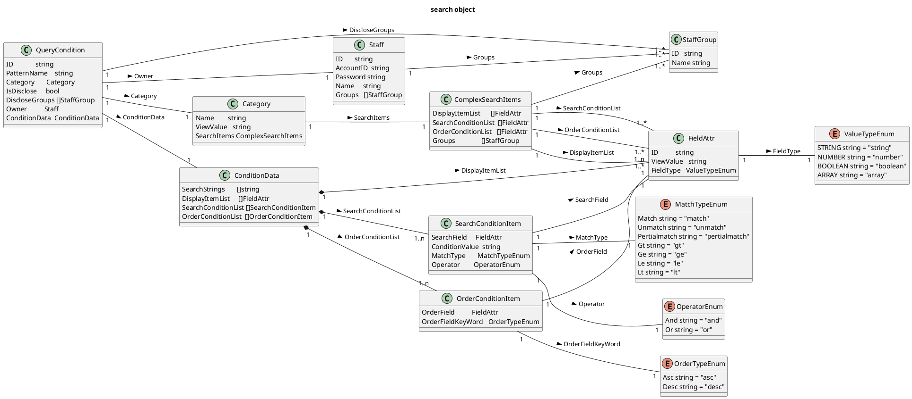
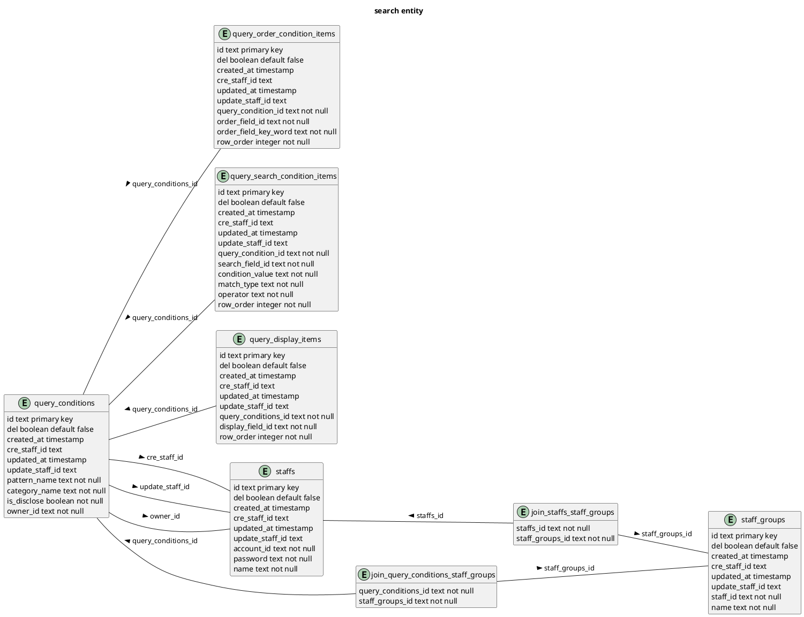

# 検索機能

- 表示項目の指定ができる。
- 検索条件の設定ができる。
- 検索結果の並び順の指定ができる。
- 表示項目・検索条件・並び替え条件を保存修正できる。

```puml
@startuml search object diagram

title: search object

left to right direction


enum ValueTypeEnum {
	STRING string = "string"
	NUMBER string = "number"
	BOOLEAN string = "boolean"
	ARRAY string = "array"
}

class FieldAttr {
	ID          string
	ViewValue   string
	FieldType   ValueTypeEnum
}

FieldAttr "1" -- "1" ValueTypeEnum : FieldType >

class StaffGroup {
	ID   string
	Name string
}

class ComplexSearchItems {
	DisplayItemList      []FieldAttr
	SearchConditionList  []FieldAttr
	OrderConditionList   []FieldAttr
	Groups               []StaffGroup
}

ComplexSearchItems "1" -- "1..*" FieldAttr : DisplayItemList >
ComplexSearchItems "1" -- "1..*" FieldAttr : SearchConditionList >
ComplexSearchItems "1" -- "1..*" FieldAttr : OrderConditionList >
ComplexSearchItems "1" -- "1..*" StaffGroup : Groups >

class Category {
	Name        string
	ViewValue   string
	SearchItems ComplexSearchItems
}

Category "1" -- "1" ComplexSearchItems : SearchItems >

enum MatchTypeEnum {
	Match string = "match"
	Unmatch string = "unmatch"
	Pertialmatch string = "pertialmatch"
	Gt string = "gt"
	Ge string = "ge"
	Le string = "le"
	Lt string = "lt"
}

enum OperatorEnum {
    And string = "and"
	Or string = "or"
}

class SearchConditionItem {
	SearchField     FieldAttr
	ConditionValue  string
	MatchType       MatchTypeEnum
	Operator        OperatorEnum
}

SearchConditionItem "1" -- "1" FieldAttr : SearchField >
SearchConditionItem "1" -- "1" MatchTypeEnum : MatchType >
SearchConditionItem "1" -- "1" OperatorEnum : Operator >

enum OrderTypeEnum {
    Asc string = "asc"
	Desc string = "desc"
}

class OrderConditionItem {
	OrderField          FieldAttr
	OrderFieldKeyWord   OrderTypeEnum
}

OrderConditionItem "1" -- "1" FieldAttr : OrderField >
OrderConditionItem "1" -- "1" OrderTypeEnum : OrderFieldKeyWord >

class ConditionData {
    SearchStrings       []string
	DisplayItemList     []FieldAttr
    SearchConditionList []SearchConditionItem
	OrderConditionList  []OrderConditionItem
}

ConditionData "1" *-- "1..n" FieldAttr : DisplayItemList >
ConditionData "1" *-- "1..n" SearchConditionItem : SearchConditionList >
ConditionData "1" *-- "1..n" OrderConditionItem : OrderConditionList >

class Staff {
	ID       string
	AccountID  string
	Password string
	Name     string
	Groups   []StaffGroup
}

Staff "1" -- "1..*" StaffGroup : Groups >

class QueryCondition {
    ID             string
	PatternName    string
	Category       Category
	IsDisclose     bool
	DiscloseGroups []StaffGroup
	Owner          Staff
	ConditionData  ConditionData
}

QueryCondition "1" -- "1" Category : Category >
QueryCondition "1" -- "1" ConditionData : ConditionData >
QueryCondition "1" -- "1" Staff : Owner >
QueryCondition "1" -- "1..*" StaffGroup : DiscloseGroups >

@enduml

```

- Categoryは永続化対象外
- ConditionData.SearchStringsは永続化対象外

```puml

@startuml search entity diagram

title: search entity

left to right direction
hide empty members

entity query_order_condition_items {
	id text primary key
	del boolean default false
	created_at timestamp
	cre_staff_id text
	updated_at timestamp
	update_staff_id text
    query_condition_id text not null
	order_field_id text not null
    order_field_key_word text not null
    row_order integer not null
}

entity query_search_condition_items {
	id text primary key
	del boolean default false
	created_at timestamp
	cre_staff_id text
	updated_at timestamp
	update_staff_id text
    query_condition_id text not null
	search_field_id text not null
    condition_value text not null
    match_type text not null
    operator text not null
    row_order integer not null
}

entity query_display_items {
	id text primary key
	del boolean default false
	created_at timestamp
	cre_staff_id text
	updated_at timestamp
	update_staff_id text
	query_conditions_id text not null
	display_field_id text not null
	row_order integer not null
}

entity join_staffs_staff_groups {
	staffs_id text not null
    staff_groups_id text not null
}

entity staff_groups {
	id text primary key
	del boolean default false
	created_at timestamp
	cre_staff_id text
	updated_at timestamp
	update_staff_id text
	staff_id text not null
	name text not null
}

entity staffs {
	id text primary key
	del boolean default false
	created_at timestamp
	cre_staff_id text
	updated_at timestamp
	update_staff_id text
	account_id text not null
	password text not null
	name text not null
}

staffs -- join_staffs_staff_groups : < staffs_id
join_staffs_staff_groups -- staff_groups : staff_groups_id >

entity join_query_conditions_staff_groups {
    query_conditions_id text not null
    staff_groups_id text not null
}

entity query_conditions {
	id text primary key
	del boolean default false
	created_at timestamp
	cre_staff_id text
	updated_at timestamp
	update_staff_id text
	pattern_name text not null
	category_name text not null
	is_disclose boolean not null
	owner_id text not null
}

query_conditions -- staffs : cre_staff_id >
query_conditions -- staffs : update_staff_id >
query_conditions -- staffs : owner_id >
query_conditions -- join_query_conditions_staff_groups : < query_conditions_id
join_query_conditions_staff_groups -- staff_groups : staff_groups_id >
query_conditions --  query_display_items : < query_conditions_id
query_conditions --  query_search_condition_items : < query_conditions_id
query_conditions --  query_order_condition_items : < query_conditions_id

@enduml
```